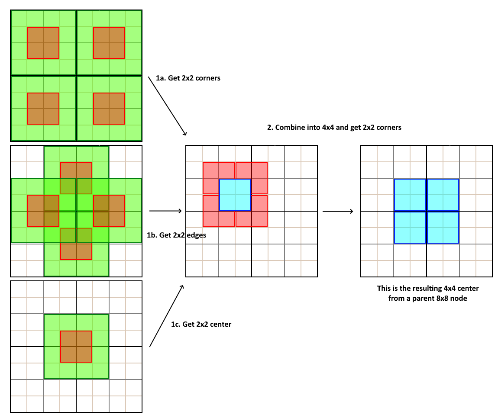
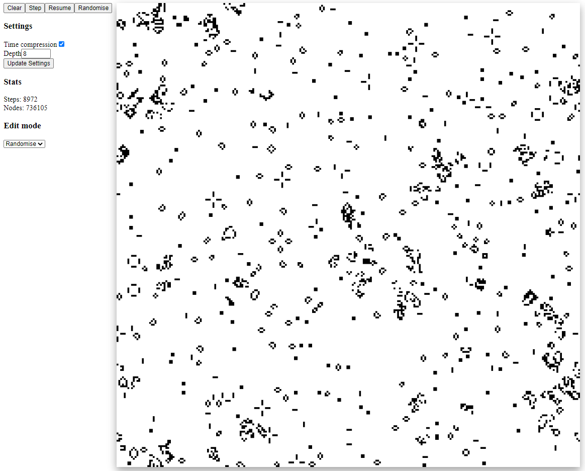

# HashLife
Implementation of hashlife. [Check it out](https://fiendchain.github.io/HashLife)

## Explanation
Implementation was heavily based on article written by Dr Dobb over [here](https://www.drdobbs.com/jvm/an-algorithm-for-compressing-space-and-t/184406478?pgno=1). Check that link for a detailed explanation.

## Short explanation
Uses a recursive implementation of game of life with memoization to speed up the simulation. The memoization can map T=i to T=i+1, which behaves like normal game of life. 

Alternatively, since the recursive implementation uses quad trees to represent the game of life state space (pixels), instead of mapping T=i to T=i+1 for the root node, we map T=i to T=k for all subnodes in the root node. (k will be explained later).

The hashmap maps a NxN node at T=i to the center N/2 x N/2 region at T=k. We have a base case for a 4x4 node to 2x2 node. 

For a NxN node we rearrange the corner nodes so we end up getting all the N/2 x N/2 nodes to recover an updated NxN node.

Consider the following:
- depth=2 (4x4): (2x2) at T=i+1 using normal simulation. 
- depth=3 (8x8): 
  - Consists of 4x4 corners at T=i 
  - (4x4) chunks [green] => (2x2) subchunks [red] at T=i+1 (Step 1)
  - Combine (2x2) subchunks into (4x4) chunk
  - (4x4) chunks [red] at T=i+1 => (2x2) subchunks [blue] at T=i+2 (Step 2)
  - Combine (2x2) subchunks into center (4x4) chunk
  - (4x4) at T=i+2 (result)
- depth=4 (16x16):
  - (8x8) chunks at T=i to (4x4) subchunks at T=i+2 (this is because of recursion)
  - Combine (4x4) subchunks into (8x8) chunk 
  - (8x8) chunks at T=i+2 to (4x4) subchunks at T=i+4 (recursion)
  - Combine (4x4) subchunks into (8x8) center chunk
  - (8x8) at T=i+4 (result)
- depth=8 (32x32): (16x16) at T=i+8

Thus we get a hashmap that maps: (NxN) at T=i to (N/2 x N/2) at T=i+(N/4).
If N=2^d, then each simulation step give T=i+2^(d-2). This gives us time compression.

## Gallery

## TODO
- Add highlighting for selected region
- Add browser to drag/drop of well known configurations (methuselahs and basic forms)
- Add loading in of configurations and seeded worlds 
